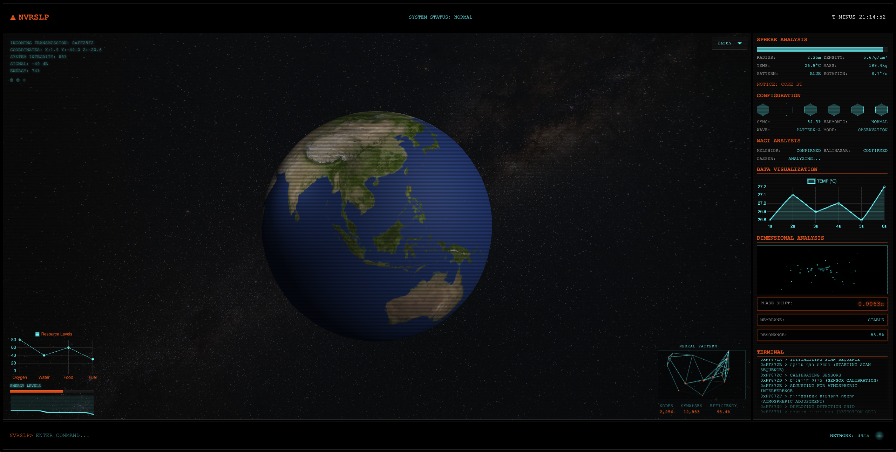

<div align="center">

```
╔══════════════════════════════════════════════════════════════╗
║                                                              ║
║   ███    ██ ██    ██ ██████  ███████ ██      ██████          ║
║   ████   ██ ██    ██ ██   ██ ██      ██      ██   ██         ║
║   ██ ██  ██ ██    ██ ██████  ███████ ██      ██████          ║
║   ██  ██ ██  ██  ██  ██   ██      ██ ██      ██              ║
║   ██   ████   ████   ██   ██ ███████ ███████ ██              ║
║                                                              ║
║             [ NEURAL VISUALIZATION SYSTEM ]                  ║
║     [ MAGI INTERFACE v1.0.3 ] [ BUILD: 2025.03.11 ]          ║
║                                                              ║
╚══════════════════════════════════════════════════════════════╝
```


</div>

## [SYSTEM OVERVIEW]

Advanced neural interface visualization platform with real-time pattern analysis and holographic display capabilities. Designed for monitoring sphere anomalies and MAGI system integration.

## [CORE SYSTEMS]

- **NEURAL PATTERN ANALYSIS**
  - Real-time node monitoring [2,481 active]
  - Synaptic mapping [12,938 connections]
  - Efficiency rating: 94.7%

- **SPHERE METRICS**
  - Radius tracking
  - Density analysis
  - Thermal monitoring
  - Mass calculation
  - Pattern recognition
  - Rotation analysis

- **MAGI INTEGRATION**
  - Triple-redundant processing
  - Real-time synchronization
  - Harmonic wave analysis

## [INSTALLATION]

```bash
# Clone repository
git clone https://github.com/yourusername/NVRSLP.git

# Navigate to directory
cd NVRSLP

# Initialize server (requires Python)
python3 -m http.server 8000
```

## [SYSTEM REQUIREMENTS]

| Component | Minimum Spec |
|-----------|-------------|
| CPU | 3.5 GHz Quad Core |
| RAM | 8GB DDR4 |
| GPU | WebGL 2.0 Compatible |
| OS | MacOS 11+ / Windows 10+ |

## [SECURITY PROTOCOLS]

```
[!] WARNING: LEVEL 3 CLEARANCE REQUIRED
[!] UNAUTHORIZED ACCESS WILL BE TRACED AND REPORTED
[!] NEURAL PATTERN ANALYSIS IS RESTRICTED
```

## [COMMAND INTERFACE]

| Key | Function |
|-----|----------|
| ESC | Emergency shutdown |
| SPACE | Pause analysis |
| R | Reset patterns |
| F | Toggle fullscreen |

## [LICENSE]

```
PROPRIETARY SOFTWARE
NVRSLP SYSTEMS DIVISION
ALL RIGHTS RESERVED © 2025
```

<div align="center">

---
`TERMINATE_README.exe`
`CONNECTION_CLOSED`

</div>
````
